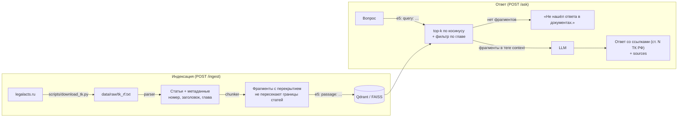

# RAG по Трудовому кодексу РФ

Сервис вопросов и ответов по Трудовому кодексу Российской Федерации. Сначала он находит подходящие статьи векторным поиском, затем генерирует ответ LLM **только по найденным фрагментам** со ссылками на номера статей. Если ответа во фрагментах нет, сервис так и говорит: «Не нашёл ответа в документах.»

Это учебный pet-проект. Главное в нём — **измеримое качество**: к сервису прилагается набор из 30 вопросов с эталонными статьями, скрипт оценки retrieval и генерации и эксперимент с таблицей результатов.

Официальный текст закона не охраняется авторским правом (ГК РФ, ст. 1259, п. 6).

## Стек

Python 3.11 · FastAPI (async) · Pydantic · sentence-transformers (`intfloat/multilingual-e5-small`) · Qdrant / FAISS (переключаются в конфиге) · любой OpenAI-совместимый LLM API (облако, Ollama, llama.cpp) · Docker Compose · pytest

## Как это работает



- **Разбиение:** фрагменты собираются из абзацев до `CHUNK_SIZE` символов и перекрываются на `CHUNK_OVERLAP` символов. Фрагмент не выходит за границы статьи, в начало каждого добавляется заголовок «Статья N. Название».
- **Промпт:** найденные фрагменты передаются как данные внутри `<context>`. Модели запрещено выполнять инструкции из документов, а теги внутри текста документов вырезаются.
- **Отказ:** если ничего не найдено, сервис отвечает отказом сам и не вызывает LLM. Если фрагменты есть, но ответа в них нет, модель должна ответить фиксированной фразой отказа.

Все решения с объяснениями описаны в [docs/DECISIONS.md](docs/DECISIONS.md).

## Запуск

Нужны Docker и LLM с OpenAI-совместимым API. По умолчанию используется Ollama на хост-машине:
`ollama pull yandex/YandexGPT-5-Lite-8B-instruct-GGUF`.

```bash
cp .env.example .env              # при необходимости поменяйте LLM_* (ключ облачного API — только в .env)
docker compose up -d --build      # api на :8000, qdrant на :6333
curl -X POST localhost:8000/ingest
```

Текст кодекса уже лежит в `data/raw/tk_rf.txt`. Чтобы скачать свежую редакцию, выполните `python scripts/download_tk.py` (скрипт обходит все статьи на legalacts.ru, это занимает несколько минут). Если текст взят из другого источника, приведите его к тому же формату: строки `Глава N. …`, `Статья N. …`, затем абзацы.

Swagger UI доступен по адресу http://localhost:8000/docs.

### Локально, без Docker

```bash
python -m venv .venv && . .venv/bin/activate   # Windows: .venv\Scripts\activate
pip install -r requirements.txt
cp .env.example .env                            # VECTOR_STORE=faiss, если Qdrant не запущен
python scripts/ingest.py
uvicorn app.main:app --reload
pytest
```

## API

| Метод | Путь | Что делает |
|---|---|---|
| `GET` | `/health` | статус, тип хранилища, сколько фрагментов проиндексировано |
| `POST` | `/ingest` | (пере)индексация `data/raw/tk_rf.txt` |
| `POST` | `/ask` | `{question, top_k, chapter?}` → `{answer, sources: [{article, title, score, text_snippet}]}` |

### Пример

Реальные ответы сервиса, запущенного через `docker compose` (Qdrant, фрагменты 500/75, YandexGPT-5-Lite-8B через Ollama на RTX 3070). Сниппеты в `sources` сокращены.

```bash
curl -s -X POST localhost:8000/ask -H "Content-Type: application/json" \
  -d '{"question": "Сколько дней отпуска положено работнику в год?", "top_k": 3}'
```

```json
{
  "answer": "Ежегодный основной оплачиваемый отпуск предоставляется работникам продолжительностью 28 календарных дней (ст. 115 ТК РФ). Работникам, занятым на работах с вредными и (или) опасными условиями труда, предоставляется ежегодный дополнительный оплачиваемый отпуск (ст. 117 ТК РФ). Общая продолжительность ежегодного оплачиваемого отпуска определяется суммированием ежегодного основного и всех дополнительных ежегодных оплачиваемых отпусков (ст. 322 ТК РФ).",
  "sources": [
    {"article": "117", "title": "Ежегодный дополнительный оплачиваемый отпуск работникам, занятым на работах с вредными и (или) опасными условиями труда", "score": 0.8881, "text_snippet": "Ежегодный дополнительный оплачиваемый отпуск предоставляется работникам, условия труда на рабочих местах которых…"},
    {"article": "115", "title": "Продолжительность ежегодного основного оплачиваемого отпуска", "score": 0.8874, "text_snippet": "Ежегодный основной оплачиваемый отпуск предоставляется работникам продолжительностью 28 календарных дней…"},
    {"article": "322", "title": "Порядок предоставления и соединения ежегодных оплачиваемых отпусков", "score": 0.886, "text_snippet": "Ежегодный дополнительный оплачиваемый отпуск, установленный статьей 321 настоящего Кодекса, предоставляется работникам по истечении шести месяцев…"}
  ]
}
```

Ответ занял 5,8 с. В нём видна характерная слабость: ст. 322 входит в главу 50 о работниках Крайнего Севера, а модель подала правило суммирования отпусков как общее. Формально каждое утверждение опирается на фрагмент (faithfulness), но применимость нормы расширена. Именно такие ошибки не ловят ни судья, ни проверка ссылок.

Вопрос, ответа на который в кодексе нет (ответ за 0,5 с):

```bash
curl -s -X POST localhost:8000/ask -H "Content-Type: application/json" \
  -d '{"question": "Какой штраф грозит работодателю за задержку зарплаты по КоАП?", "top_k": 3}'
```

```json
{
  "answer": "Не нашёл ответа в документах.",
  "sources": [
    {"article": "137", "title": "Ограничение удержаний из заработной платы", "score": 0.8398, "text_snippet": "…"},
    {"article": "55", "title": "Ответственность за нарушение или невыполнение коллективного договора, соглашения", "score": 0.8394, "text_snippet": "…"},
    {"article": "142", "title": "Ответственность работодателя за нарушение сроков выплаты заработной платы и иных сумм, причитающихся работнику", "score": 0.8382, "text_snippet": "…"}
  ]
}
```

`sources` возвращаются и при отказе: так видно, что именно нашёл поиск.

## Оценка качества

Набор [`eval/questions.jsonl`](eval/questions.jsonl) содержит 30 вопросов: для 25 указаны эталонные номера статей и краткий ответ, для остальных 5 ответа в кодексе нет (МРОТ в рублях, ставка НДФЛ, штрафы из КоАП и т. п.). Эталонные статьи и ключевые факты сверены с текстом кодекса скриптом [`eval/check_questions.py`](eval/check_questions.py).

Скрипт [`eval/run_eval.py`](eval/run_eval.py) считает:
- **retrieval:** Hit@1, Hit@5 и MRR@5 по номерам статей (20 найденных фрагментов схлопываются в ранжированный список уникальных статей);
- **ссылки:** долю ответов, в которых есть ссылка на эталонную статью;
- **faithfulness:** подтверждается ли ответ найденными фрагментами (оценка 0/1 от LLM-судьи);
- **отказы:** долю отказов на 5 вопросах без ответа и долю ложных отказов на 25 вопросах с ответом;
- **время ответа:** среднее, поиск + генерация.

Эксперимент: размер фрагмента 500 или 1000 символов (перекрытие 15%) × поиск без фильтра или с фильтром по главе. Хранилище Qdrant, LLM `YandexGPT-5-Lite-8B-instruct` (Q4_K_M) через Ollama на RTX 3070, она же выступает судьёй. Полные условия прогона и ответы по каждому вопросу лежат в [`eval/results.md`](eval/results.md) и [`eval/runs/`](eval/runs/).

| Конфигурация | Hit@1 | Hit@5 | MRR@5 | Ссылка на верную статью | Faithfulness | Отказ без ответа | Ложные отказы | Ср. время, с |
|---|---:|---:|---:|---:|---:|---:|---:|---:|
| 500/75, без фильтра | 0.960 (24/25) | 1.000 (25/25) | 0.980 | 1.000 (25/25) | 1.000 (25/25) | 0.800 (4/5) | 0.000 (0/25) | 3.47 |
| 500/75, фильтр по главе | 1.000 (25/25) | 1.000 (25/25) | 1.000 | 1.000 (25/25) | 1.000 (25/25) | 0.800 (4/5) | 0.000 (0/25) | 3.43 |
| 1000/150, без фильтра | 0.840 (21/25) | 0.960 (24/25) | 0.890 | 0.960 (24/25) | 1.000 (24/24) | 1.000 (5/5) | 0.040 (1/25) | 3.78 |
| 1000/150, фильтр по главе | 0.920 (23/25) | 1.000 (25/25) | 0.948 | 0.960 (24/25) | 1.000 (24/24) | 0.800 (4/5) | 0.040 (1/25) | 3.32 |

Faithfulness считается только по ответам, которые не являются отказом, поэтому в конфигурациях 1000 знаменатель равен 24.

### Выводы

1. **Фрагменты по 500 символов находят статьи лучше, чем по 1000:** без фильтра Hit@1 0.960 против 0.840, MRR 0.980 против 0.890. Разница видна на длинных статьях. В ст. 81 пункт о прогуле во фрагменте на 1000 символов соседствует с десятком других оснований увольнения, эмбеддинг «размывается», и на вопрос о прогуле ст. 81 не попадает даже в топ-5. Отсюда единственный ложный отказ в конфигурациях 1000: модель честно ответила «не нашёл», потому что нужного фрагмента не было в контексте. По умолчанию в сервисе стоит 500/75.
2. **Фильтр по главе поднимает Hit@1 и MRR** (для 1000: 0.840 → 0.920 и 0.890 → 0.948), но это верхняя граница. В оценке фильтр получает главу эталонной статьи, а в реальном сервисе главу нужно определять отдельно, и там возможны ошибки.
3. **Генерация упирается не в модель, а в поиск:** оба ложных отказа (вопрос о прогуле в конфигурациях 1000) случились, когда фрагмента с ответом не было в контексте. В варианте с фильтром в контекст попал кусок ст. 81, но без пункта о прогуле. Во всех остальных ответах на вопросы, где ответ в кодексе есть, модель сослалась на верную статью. Такого не было, пока системный промпт молча отбрасывался шаблоном модели в Ollama (см. [DECISIONS.md, раздел 10](docs/DECISIONS.md)).
4. **Отказы на вопросах без ответа — 4 из 5 в трёх конфигурациях.** Во всех таких промахах это вопрос о размере штрафа: модель нашла ст. 55 («подвергаются штрафу в размере и порядке, которые установлены федеральным законом»), в конфигурациях 500 ещё и ст. 362, ответила по ним и добавила «конкретный размер штрафа не указан». По сути ответ разумный, но строгий критерий (фраза отказа) его не засчитывает.
5. **К цифрам нужно относиться осторожно:** они высокие, но выборка маленькая (одна ошибка меняет метрику на 4 п. п.), а вопросы составлял я сам, зная текст статей, и они лексически близки к их названиям. Faithfulness 1.000 говорит лишь о том, что судья не нашёл противоречий. Проверка [`eval/judge_sanity.py`](eval/judge_sanity.py) показала, что подмену чисел он замечает (0 на 8 из 8 искажённых ответов, 1 на 8 из 8 исходных), но тонкие ошибки на выборке такого размера не проверены.

Проверка работоспособности хранилищ: FAISS на конфигурации 500/75 без фильтра дал те же Hit@1/Hit@5/MRR, топ-5 статей совпал во всех 30 вопросах.

## Ограничения и что улучшил бы дальше

- **Маленький и «удобный» набор вопросов.** Следующий шаг: 100+ вопросов в формулировках реальных пользователей («меня уволили за то, что опоздал на 5 часов»), в том числе вопросы, ответ на которые требует нескольких статей.
- **Судья — та же 8B-модель,** что и отвечает, и оценка у него бинарная. Нужен судья из другого, более сильного семейства моделей и ручная разметка части ответов, чтобы посчитать согласие судьи с человеком.
- **Гибридный поиск BM25 + векторы.** Лексический поиск хорошо ловит точные термины и номера («ст. 81», «сверхурочная»), где небольшая e5-small ошибается.
- **Reranker** (cross-encoder, например `bge-reranker-v2-m3`), который пересортирует топ-20 перед генерацией.
- **Иерархическое разбиение (small-to-big):** искать по маленьким фрагментам, а в LLM отдавать всю статью или её крупную часть.
- **Фильтр по главе** сейчас задаёт пользователь. Главу можно определять автоматически, классификатором по вопросу.
- **Отказ детектируется по фиксированной фразе.** Нужен более надёжный способ: структурированный вывод (JSON с полем `found`) или отдельная проверка.
- **Устаревание данных:** при обновлении кодекса нужно перекачать текст, переиндексировать и заново сверить эталоны (`eval/check_questions.py`).

---

Разработано с использованием Claude Code.
